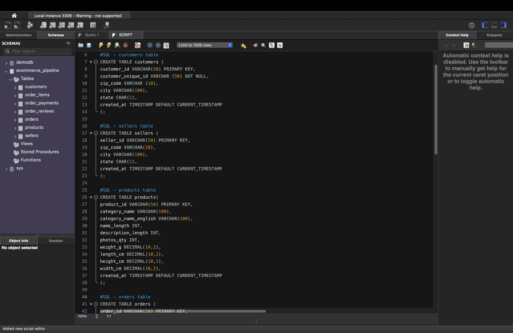
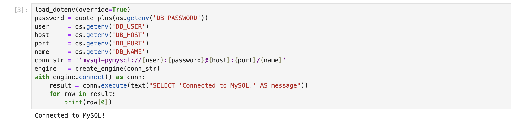

# E-Commerce Data Pipeline & Analytics


> **Business question:** Which product categories, states, 
> and sellers drive the most revenue — and where does freight 
> cost reduce margins most?

---

## Key Findings

- **Health & Beauty** is the highest revenue category
- **São Paulo (SP)** accounts for over 40% of all orders
- **Furniture/décor** categories carry freight costs above 
  20% of revenue — the biggest margin leak in the business
- **57% of customers** give 5-star reviews showing strong 
  overall satisfaction
- Pipeline processes **541,909 raw transactions** across 
  8 CSV files producing clean analytics in under 60 seconds

---

## Pipeline Architecture

```
Raw CSVs (8 files, 541,909 rows)
         ↓
Python — pandas cleaning and transformation
         ↓
MySQL — 7-table normalised schema with foreign keys
         ↓
Python — 8 analytical SQL queries
         ↓
matplotlib — 5 production-ready charts
```

---

## Two ETL Approaches — Same Output

| Approach | Tool | For whom |
|----------|------|----------|
| Code-based ETL | Python + pandas | Technical teams |
| Visual ETL | Alteryx One | Business teams |

---

## Alteryx Workflow


8 tools — 0 errors — 110,197 clean records output.

[Full Alteryx documentation](alteryx/workflow_notes.md)

---

## MySQL Schema — 7 Tables



Tables: customers, sellers, products, orders, 
order_items, order_payments, order_reviews.

All connected with foreign keys and indexed for 
query performance.

---

## Python Pipeline



---

## Analytical Queries — 8 Business Questions

| # | Question | Output |
|---|----------|--------|
| 1 | Monthly revenue trend | Line chart |
| 2 | Revenue by product category | Bar chart |
| 3 | Revenue by state | Bar chart |
| 4 | Delivery performance by state | CSV report |
| 5 | Payment method breakdown | CSV report |
| 6 | Review score distribution | Bar chart |
| 7 | Top sellers by revenue | CSV report |
| 8 | Freight cost as % of revenue | Bar chart |

---

## Tools & Skills Demonstrated

| Tool | Techniques |
|------|-----------|
| Python | pandas ETL, SQLAlchemy, matplotlib, Jupyter |
| MySQL | Schema design, foreign keys, indexes, analytical SQL |
| Alteryx One | Visual ETL — Filter, Select, Formula, Join, Output |
| GitHub | Version control, documentation, security (.env) |

---

## How to Run

**Python pipeline:**
```bash
# 1. Clone the repo
git clone https://github.com/MarkMaxwel112075/ecommerce-data-pipeline

# 2. Install dependencies
pip install -r requirements.txt

# 3. Create .env file from template
cp .env.example .env
# Add your MySQL password to .env

# 4. Download dataset from Kaggle into data/raw/
# https://www.kaggle.com/datasets/olistbr/brazilian-ecommerce

# 5. Create MySQL schema
mysql -u root -p < 01_create_schema.sql

# 6. Open and run Jupyter notebook
jupyter notebook ecommerce_pipeline.ipynb
```

**Alteryx workflow:**
```
1. Open Alteryx One at us1.alteryxcloud.com
2. Upload CSV files from data/raw/
3. Follow steps in alteryx/workflow_notes.md
```

---

## Project Structure

```
ecommerce-data-pipeline/
├── ecommerce_pipeline.ipynb  ← Full Python pipeline
├── 01_create_schema.sql      ← MySQL schema (7 tables)
├── alteryx/
│   ├── workflow_notes.md     ← Alteryx documentation
│   └── alteryx_workflow.png  ← Canvas screenshot
├── docs/
│   └── screenshots/          ← Project screenshots
├── requirements.txt
├── .env.example
└── .gitignore
```

---

## Data Source

Brazilian E-Commerce by Olist — 100,000 real orders 
from 2016 to 2018 across 8 CSV files.

Source: https://www.kaggle.com/datasets/olistbr/brazilian-ecommerce
